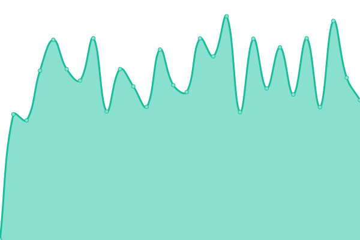

# [📈 Live Status](https://status.bonny.pw): <!--live status--> **🟧 Partial outage**

This repository contains the open-source uptime monitor and status page for [bonny1992](https://status.bonny.pw), powered by [Upptime](https://github.com/upptime/upptime).

With [Upptime](https://upptime.js.org), you can get your own unlimited and free uptime monitor and status page, powered entirely by a GitHub repository. We use [Issues](https://github.com/bonny1992/status/issues) as incident reports, [Actions](https://github.com/bonny1992/status/actions) as uptime monitors, and [Pages](https://status.bonny.pw) for the status page.

<!--start: status pages-->
<!-- This summary is generated by Upptime (https://github.com/upptime/upptime) -->
<!-- Do not edit this manually, your changes will be overwritten -->
<!-- prettier-ignore -->
| URL | Status | History | Response Time | Uptime |
| --- | ------ | ------- | ------------- | ------ |
|  Affiliate | 🟥 Down | [affiliate.yml](https://github.com/bonny1992/upptime/commits/HEAD/history/affiliate.yml) | 

 617ms
     
 | 

<a href="https://status.bonny.pw/history/affiliate">99.99%</a>
    

|  Bonosaglass.com | 🟩 Up | [bonosaglass-com.yml](https://github.com/bonny1992/upptime/commits/HEAD/history/bonosaglass-com.yml) | 

 879ms
     
 | 

<a href="https://status.bonny.pw/history/bonosaglass-com">100.00%</a>
    

|  Jackett | 🟥 Down | [jackett.yml](https://github.com/bonny1992/upptime/commits/HEAD/history/jackett.yml) | 

 928ms
     
 | 

<a href="https://status.bonny.pw/history/jackett">99.99%</a>
    

|  Prowlarr | 🟥 Down | [prowlarr.yml](https://github.com/bonny1992/upptime/commits/HEAD/history/prowlarr.yml) | 

 596ms
     
 | 

<a href="https://status.bonny.pw/history/prowlarr">99.99%</a>
    

|  Ombi | 🟥 Down | [ombi.yml](https://github.com/bonny1992/upptime/commits/HEAD/history/ombi.yml) | 

 557ms
     
 | 

<a href="https://status.bonny.pw/history/ombi">99.99%</a>
    

|  Overseerr | 🟥 Down | [overseerr.yml](https://github.com/bonny1992/upptime/commits/HEAD/history/overseerr.yml) | 

 1143ms
     
 | 

<a href="https://status.bonny.pw/history/overseerr">99.99%</a>
    

|  Deluge | 🟥 Down | [deluge.yml](https://github.com/bonny1992/upptime/commits/HEAD/history/deluge.yml) | 

 468ms
     
 | 

<a href="https://status.bonny.pw/history/deluge">99.99%</a>
    

|  NZBGet | 🟥 Down | [nzbget.yml](https://github.com/bonny1992/upptime/commits/HEAD/history/nzbget.yml) | 

 460ms
     
 | 

<a href="https://status.bonny.pw/history/nzbget">99.99%</a>
    

|  NZBHydra2 | 🟥 Down | [nzbhydra2.yml](https://github.com/bonny1992/upptime/commits/HEAD/history/nzbhydra2.yml) | 

 870ms
     
 | 

<a href="https://status.bonny.pw/history/nzbhydra2">99.99%</a>
    

|  Sonarr | 🟥 Down | [sonarr.yml](https://github.com/bonny1992/upptime/commits/HEAD/history/sonarr.yml) | 

 580ms
     
 | 

<a href="https://status.bonny.pw/history/sonarr">99.99%</a>
    

|  Radarr | 🟥 Down | [radarr.yml](https://github.com/bonny1992/upptime/commits/HEAD/history/radarr.yml) | 

 579ms
     
 | 

<a href="https://status.bonny.pw/history/radarr">99.99%</a>
    

|  Lidarr | 🟥 Down | [lidarr.yml](https://github.com/bonny1992/upptime/commits/HEAD/history/lidarr.yml) | 

 514ms
     
 | 

<a href="https://status.bonny.pw/history/lidarr">99.99%</a>
    

|  PlexPy | 🟥 Down | [plexpy.yml](https://github.com/bonny1992/upptime/commits/HEAD/history/plexpy.yml) | 

 578ms
     
 | 

<a href="https://status.bonny.pw/history/plexpy">99.99%</a>
    

|  Filebot | 🟥 Down | [filebot.yml](https://github.com/bonny1992/upptime/commits/HEAD/history/filebot.yml) | 

 599ms
     
 | 

<a href="https://status.bonny.pw/history/filebot">0.00%</a>
    

|  Synclounge | 🟥 Down | [synclounge.yml](https://github.com/bonny1992/upptime/commits/HEAD/history/synclounge.yml) | 

 596ms
     
 | 

<a href="https://status.bonny.pw/history/synclounge">99.99%</a>
    

|  Bazarr | 🟥 Down | [bazarr.yml](https://github.com/bonny1992/upptime/commits/HEAD/history/bazarr.yml) | 

 577ms
     
 | 

<a href="https://status.bonny.pw/history/bazarr">99.99%</a>
    

|  NextCloud | 🟥 Down | [nextcloud.yml](https://github.com/bonny1992/upptime/commits/HEAD/history/nextcloud.yml) | 

 867ms
     
 | 

<a href="https://status.bonny.pw/history/nextcloud">99.99%</a>
    

<!--end: status pages-->

[**Visit our status website →**](https://status.bonny.pw)

## 📄 License

- Powered by: [Upptime](https://github.com/upptime/upptime)
- Code: [MIT](./LICENSE) © [bonny1992](https://status.bonny.pw)
- Data in the `./history` directory: [Open Database License](https://opendatacommons.org/licenses/odbl/1-0/)
